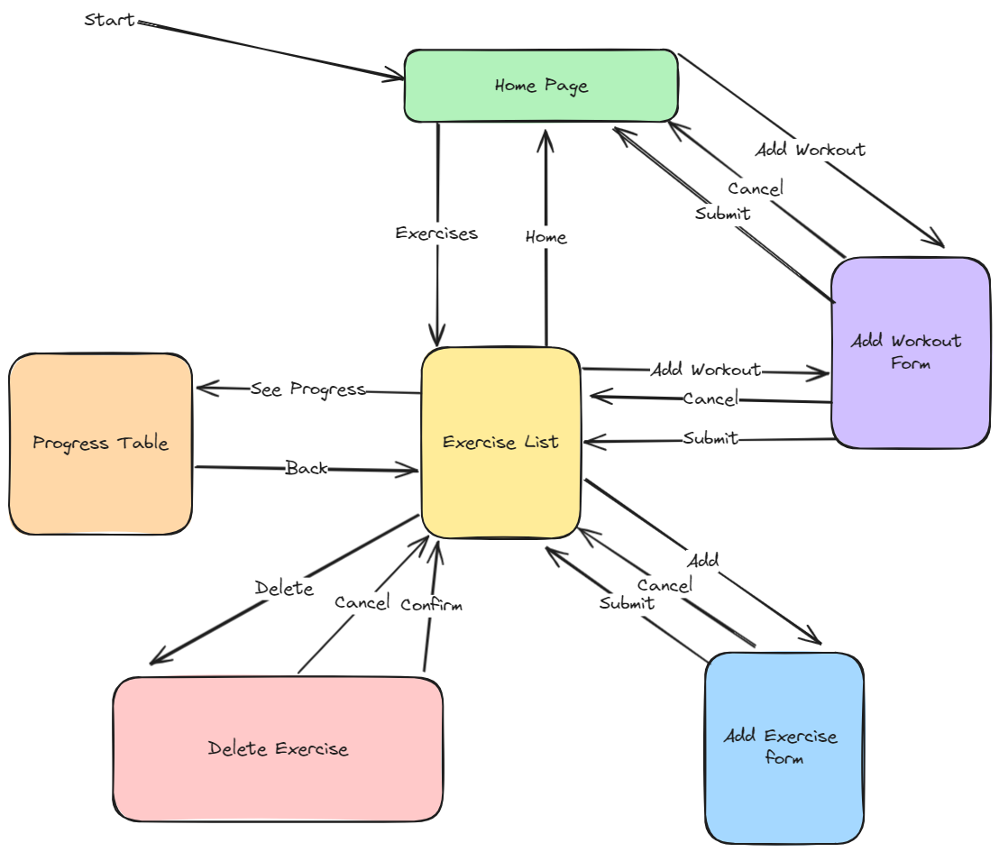

# Development of a Database-Linked Website for NCEA Level 2

Project Name: **Bayley's Epic Workout App**

Project Author: **Cooper Holmes**

Assessment Standards: **91892** and **91893**

-------------------------------------------------

## Design, Development and Testing Log

### 16/05/24

Designing the database

### 20/05/24

Designing the UI for the website

created a flow chart to show how the site would work, Not sure about the add workout section, will get feedback.

### 21/05/24

Got feedback from my user about how he wants the add workout form to work
> It Should be accessible from the exercise list as well, so I don't have to go back to the home page to add a workout.

So I changed the flow chart to show it being accessible fro  the exercise list 

### DATE HERE

Replace this test with what you are working on

Replace this text with brief notes describing what you worked on, any decisions you made, any changes to designs, etc. Add screenshots / links to other media to illustrate your notes where necessary.

### DATE HERE

Replace this test with what you are working on

Replace this text with brief notes describing what you worked on, any decisions you made, any changes to designs, etc. Add screenshots / links to other media to illustrate your notes where necessary.

### DATE HERE

Replace this test with what you are working on

Replace this text with brief notes describing what you worked on, any decisions you made, any changes to designs, etc. Add screenshots / links to other media to illustrate your notes where necessary.