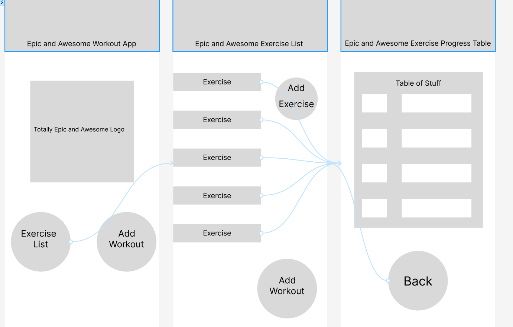
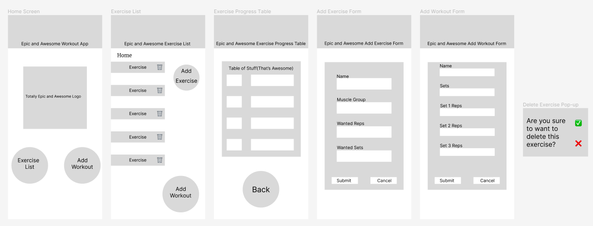
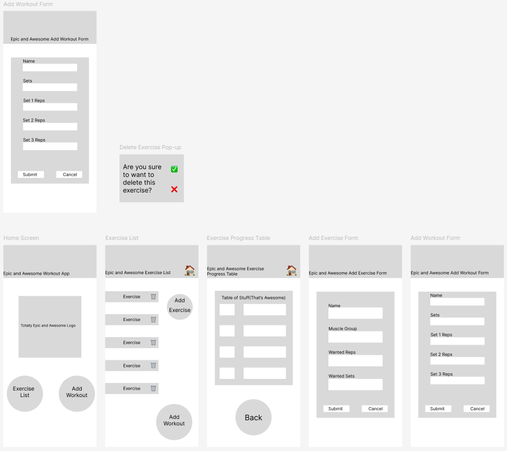

# Development of a Database-Linked Website for NCEA Level 2

Project Name: **Bayley's Epic Workout App**

Project Author: **Cooper Holmes**

Assessment Standards: **91892** and **91893**

-------------------------------------------------

## Design, Development and Testing Log

### 16/05/24

Designing the database

### 20/05/24

Designing the UI for the website

created a flow chart to show how the site would work, Not sure about the add workout section, will get feedback.

### 21/05/24

Got feedback from my user about how he wants the add workout form to work
> It Should be accessible from the exercise list as well, so I don't have to go back to the home page to add a workout.

So I changed the flow chart to show it being accessible fro  the exercise list 

### 23/05/24

Creating version 1 of the UI in figma

Didn't finish, will show to user, get feedback, and finish next time.

### 27/05/24

Finished V1 of UI in figma

Was unable to meet and get feedback, so I finished the design of the Ui with my current ideas and will show to the user for feedback.

### 30/05/24

Got Feedback from the End User on the Figma UI design

> Yeah that should work, But maybe put the home button up the top, and make it like a home symbol, and also put a home button on the exercise table as well. And Also make it so that if I add a workout from the home page, it takes me back to the home page, rather than taking me straight to the exercise table.

### 10/06/24

Acted on the feedback and made some changes to the UI design

I added the small home symbol into the header but I did need to move the title of the pages over to do so, I also had to make a second "add workout form" page to simulate it being a single page that can take you back to where you entered the form from:

