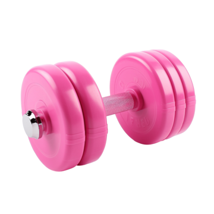

# Bayley's Epic Workout App

## Purpose

This project is a system that will allow a user to track their workouts and see progress on different workouts over time 

## Features

- Allows the user to enter new exercises and workouts
- Allows user to see a table of their progress over time
- Allows the user to delete certain exercises and workouts
- Allows the user to add and remove exercises from different workouts, allowing one exercise to be in multiple workouts

## Documentation
 
The following documents support this project:

- [Design & Review](docs/Design.md)
- [Development & Testing](docs/Development.md)
