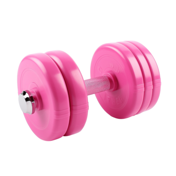

# The-Bat-Cave-200DTD-Assessment-
Bayley's Epic Workout App

## Purpose

This project is a system that will allow a user to track their workouts and see progress on different exercises over time 

## Features

- Allows the user to enter new exercises
- Allows user to see a table of a certain exercise over time to see their improvement
- Allows the user to delete certain exercises

## Documentation
 
The following documents support this project:

- [Design & Review](Design.md)
- [Development & Testing](Development.md)