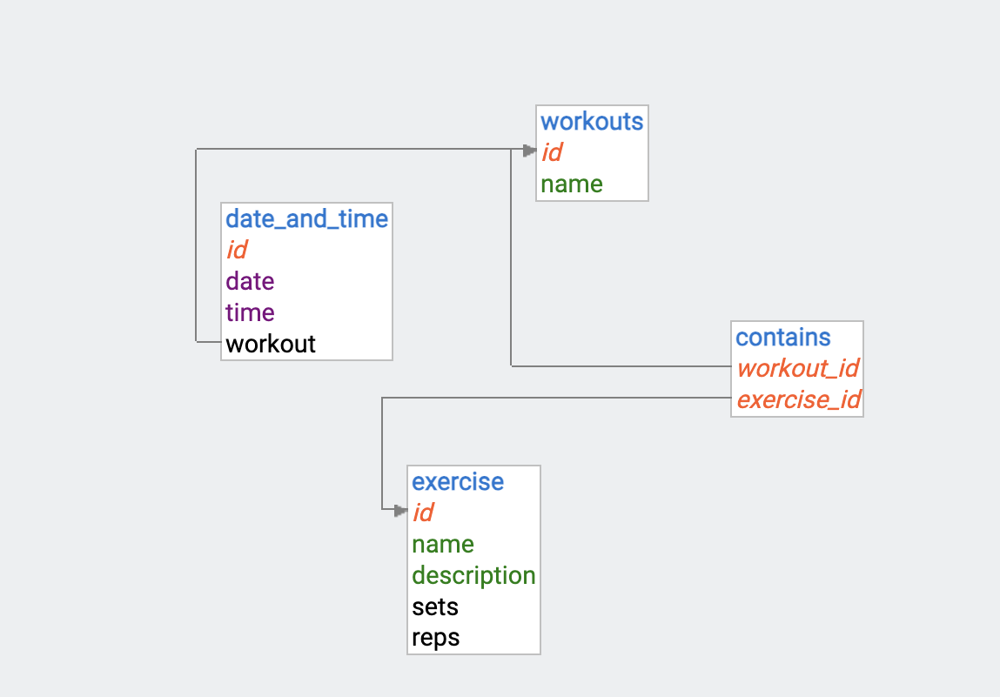
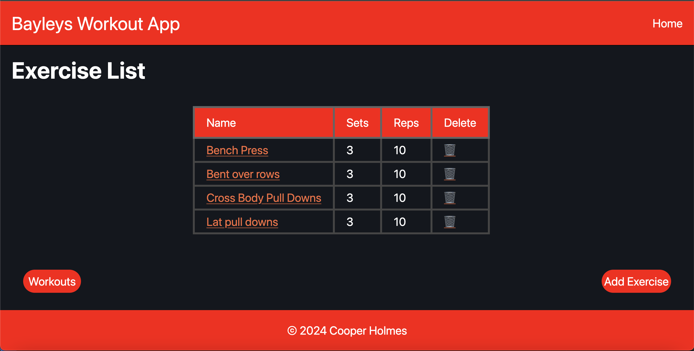
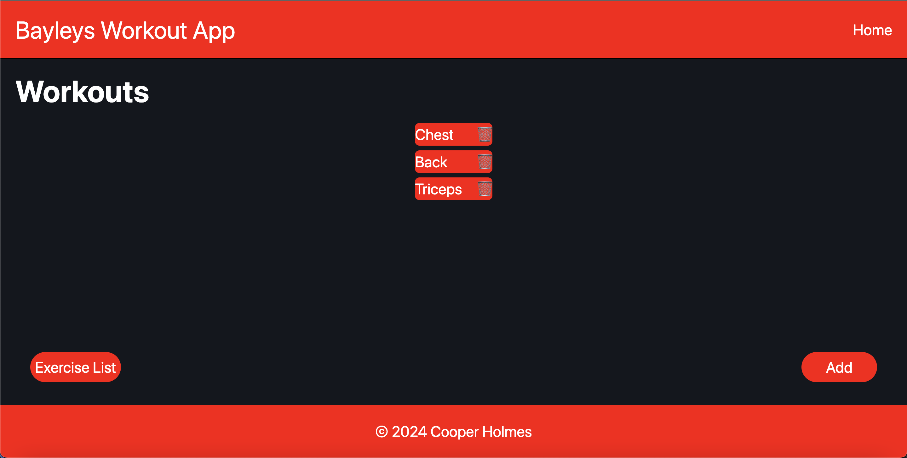
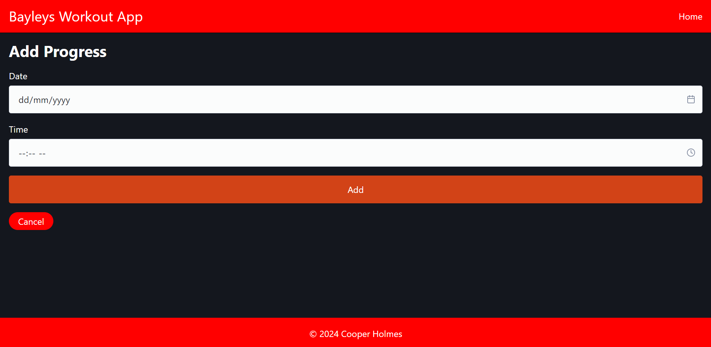
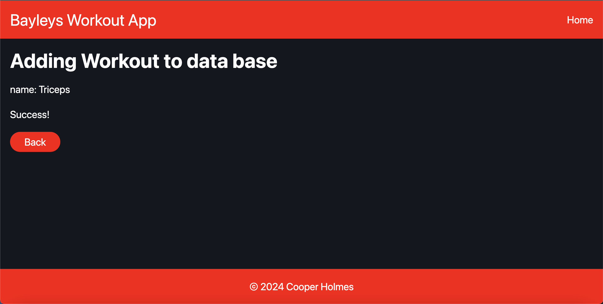
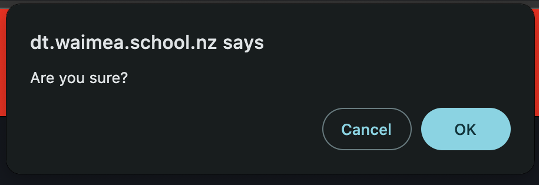
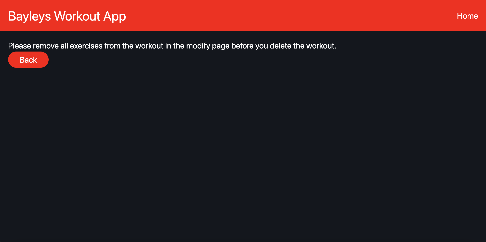

# The Design of a Database-Linked Website for NCEA Level 2

Project Name: **Bayley's Epic Workout App**

Project Author: **Cooper Holmes**

Assessment Standards: **91892** and **91893**

-------------------------------------------------

## System Requirements

### Identified Need or Problem

My brother needs a way to help him track his workouts so he can see his progress overtime, But it is not easy for him to keep track of the amount of sets and reps he does for each exercise, as he does many exercises in each workout, a website to help him keep track of this would be very helpful.

### End-User Requirements

The user of my website will be a 18 year old who wants to track his workouts so he can see his progress over time.
The user wants a way to see lists of the sets he does on each  exercise, and be able to add and remove exercises from each workout, as well as add progress for each workout. They could do this via mobile phone or computer. Their IT skills are average so i will want the site to be intuitive to use but still styles in an appealing way that relates to the gym.

### Proposed Solution

The proposed solution is a website for the user which allows him to Record his exercises and workouts and store that data so it can be seen in a table to show his progress over time. The website will also allow the user to add and remove exercises from each workout, and then add progress to those workouts.

-------------------------------------------------

## Relevant Implications

### Functionality

The functionality implications of a digital technology or digital outcome relate to how well it works for the end-user, in terms of meeting its intended purpose.

I need to design my system to have no faults as I want the end-user to have as smooth of an experience as possible when using the system

When I am designing my website I will refer to nielsen's heuristics and try to make sure that the UI meets them as best as possible, specifically I want my UI to do everything that it is supposed to do, and it meets it's purpose of tracking my brother's workouts. I want to ensure that their are no bugs in the entirety of my UI, all while it is entirely crash free. I also want to ensure that my brother can see that it is working from his point of view. To test this I will show my UI to my user and obtain valuable feedback.

### Usability

The usability implications of a digital technology or digital outcome relate to how easy it is to use for the end-user, without the need for help or guidance.

I will need to design my system to be as usable as possible as the user may not be as experienced with It as i am, I will need to make sure my website could be used by anyone with any level if IT experience

When I am designing my website I will refer to nielsen's heuristics and try to make sure that the UI meets them as best as possible, specifically I want my UI to Follow standard conventions, have everything in the correct place where it would normally be, I want the behaviour of the outcome to be familiar andd logical so anyone could make sense of it, And i want the user to be given clear directions on what to do and have a clear way on how to undo/cancel. And i always want the user to be aware of what is happening, so they do not get confused if the system takes longer to do something than normal.

### Aesthetics

The aesthetic implications of a digital technology or digital outcome relate to how it looks in terms of design.

Aesthetics is important to my system as I want it to be appealing and catch the eye of the user. And it is important it follows the design conventions.

When I am designing my website I will refer to nielsen's heuristics and try to make sure that the UI meets them as best as possible, specifically I want my UI to appeal to my user, meaning I will need to create designs and show it to the user to decide which they find most appealing, I want the design to be suitable for the outcomes purpose and not seem idiotic. I want to use colours and fonts that work together, to create a pleasing effect. I want everything to be correctly positioned so it doesn't seem unfamiliar.

### End-Users

The end-user implications of a digital technology or digital outcome are connected to the specific needs of the end-user(s).

I need to design my system to be meet the users needs so they can be comfortable using the website, and i need to ensure it works on the devices my brother would use.

When I am designing my website I will refer to nielsen's heuristics and try to make sure that the UI meets them as best as possible, specifically I want my UI to know as much about the user as possible in terms of age, gender etc. I want it to use appropriate language so it doesn't seem unfamiliar and is comfortable to use. I will need to regular get feedback and always take it into account while I am designing the system. And I will need to ensure it works on many devices, as the user may use more than one device.

### Social

The social implications of a digital technology or digital outcome involve how it affects users, the wider community and society as a whole.

I need to design my system to not misrepresent any social groups or cause any offence and I want it too appeal to all social groups.

I will need to avoid putting in any racist or bigoted details in the system and using gender neutral pronouns whenever possible, all while avoiding the promotion of any drugs or bad activities.

-------------------------------------------------

## Final System Design

### Database Structure

### User Interface Design

-------------------------------------------------

## Completed System

### Database Structure

I added the date and time table as i realised i actually needed a way to track the progress of each workout, I also removed the muscle group section from the workout table, as one workout can contain exercises that can target different muscle groups than others in the same workout.

### User Interface Design

My home page has been altered slightly as well as the exercise list now being a table, the workout list is now a thing as well.

-------------------------------------------------

## Review and Evaluation

### Meeting the Needs of the Users

I met all of the needs of my end user, as my systen is able to help my brother track each of his workouts, add and remove exercises from each workouts, as well as him being able to track when he has done each workout with the progress section, he can also add and remove exercises and workouts.

### Meeting the System Requirements

I met the system requirements by ensuring that my user is able to add and remove exercises and workouts, as well as track their progress for each workout, as well as them being able to add and remove exercises from each workout

### Review of Functionality

I successfully addressed this in my system by thoroughly checking that every single use of my system was functional, and there was nothing that the user could do that would lead to a failure or error in the sytem that would leave the the user with no options, or see an error message.

### Review of Usability 

I successfully addressed this in my system through ensuring that everything in my system is logical and it makes sense, my user should have no difficulties when it comes to undertanding how to navigate the website as it is all straigh forward, and they also should have no problem when understanduing how to undo/cancel something.

I also follow all of Nielson's heuristics as show below:

Visibility of System Status:

I follow this by having my user be shown exeactly what has been added to the data base after completing a form in every form exept for the modifying form:

Match Between System and Real World:

I did this through using Bins as the button to delete items:

User Control and Freedom:

I did this by giving my user a clear way to cancel their wish to delete any items:

Consistency and Standards:

I follow this by ensuring that all of my oages have the same base layout:

Error Prevention:

I follow this by ensuring that my user has to confirm when they want to delete a piece of data:

Recognition Rather Than Recall:

I follow this by ensuring that all of my links that are in tables are highlighted in a different colour and underlined so it is obvious they are links the user can click on:

Flexibility and efficiency of use:

I followed this by ensuring that everything in my page is listed in step by step actions that my user can follow to complete all of the actions in my system 

Aesthetics and Minimalist Design:

I Followed this heuristic by having a very basic design in  all of my pages so its easy to understand:

Help Users Recognize, Diagnose, and Recover from Errors:

I follow this heuristics so if the user attempts to delete a workout that still contains exercises, they receive a message that tells them to remove the exercises from the workout before they delete the workout:

Help and Documentation:

I do not follow this heuristic in my system, as I did not feel it was needed, the system is very simple and straightforward do my user should not need any help

### Review of Aestestics

I successfully addressed this in my system through constantly shwoing my designs to my end user, and altering the colours and making other smaller design changes based on their opinions.

### Review of Social

I successfully addressed this implication in my system by ensuring that i never used any racist or bigoted terms, I also didn't use any pronouns in my system, as there was no point where it would be needed.
