# Development of a Database-Linked Website for NCEA Level 2

Project Name: **Bayleys Epic Workout App**

Project Author: **Cooper Holmes**

Assessment Standards: **91892** and **91893**

-------------------------------------------------

## Design, Development and Testing Log

### 16/05/24

Designing the database

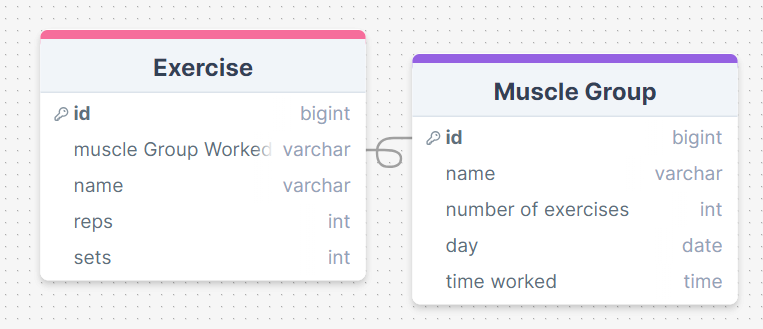

### 20/05/24

Designing the UI for the website

created a flow chart to show how the site would work, Not sure about the add workout section, will get feedback.
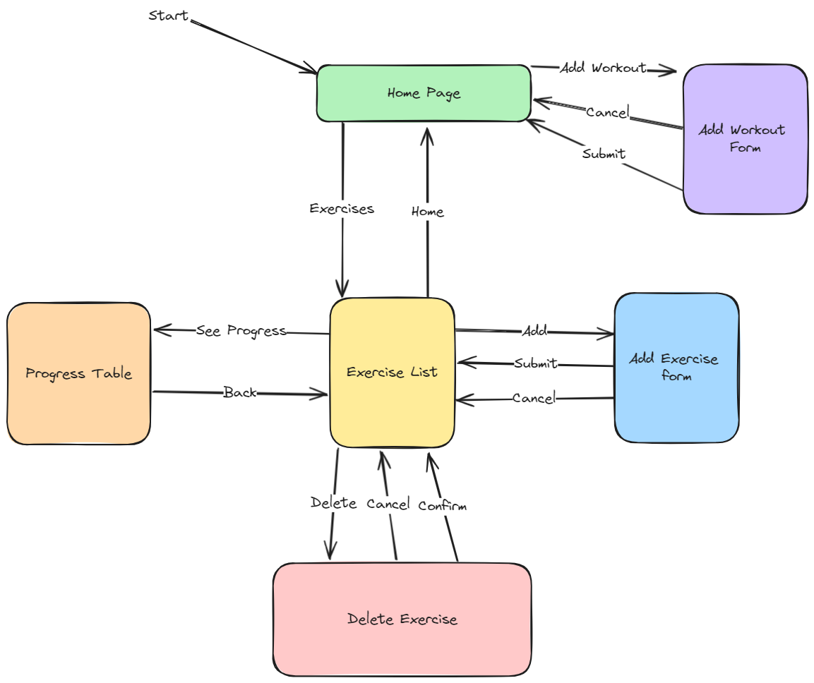

### 21/05/24

Got feedback from my user about how he wants the add workout form to work
> It Should be accessible from the exercise list as well, so I don't have to go back to the home page to add a workout.

So I changed the flow chart to show it being accessible fro  the exercise list 
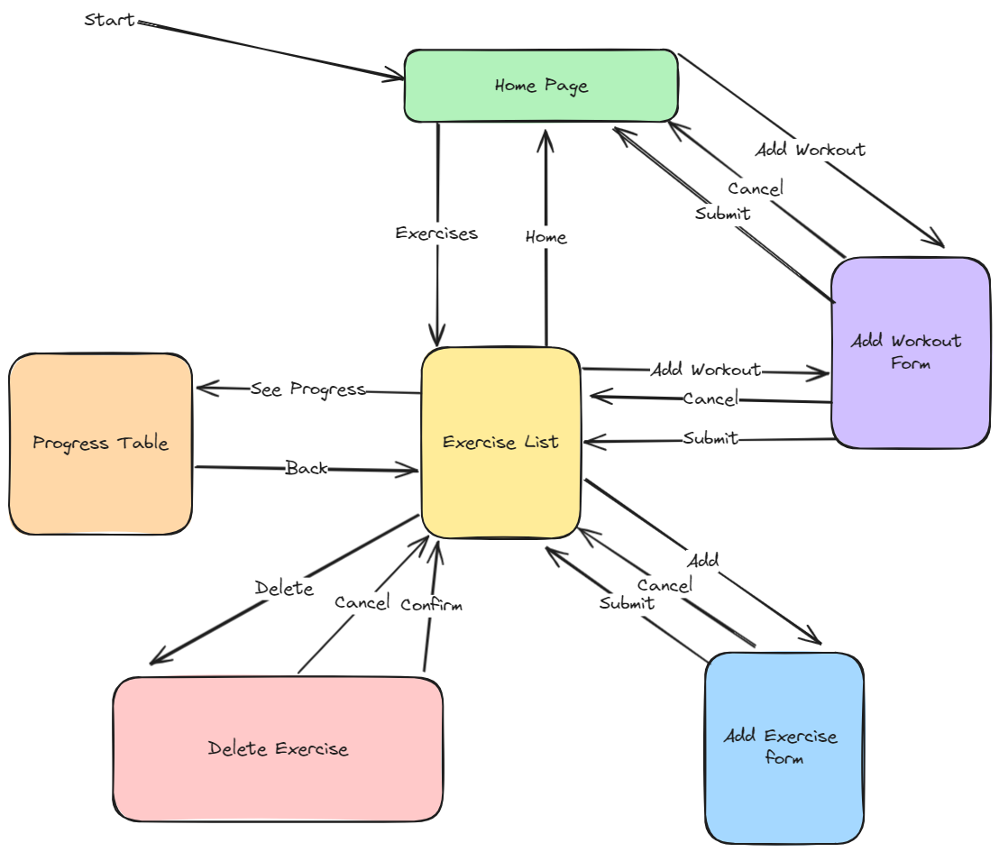

### 23/05/24

Creating version 1 of the UI in figma

Didn't finish, will show to user, get feedback, and finish next time.
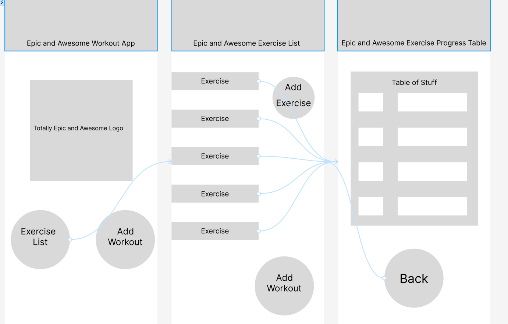

### 27/05/24

Finished V1 of UI in figma

Was unable to meet and get feedback, so I finished the design of the Ui with my current ideas and will show to the user for feedback.
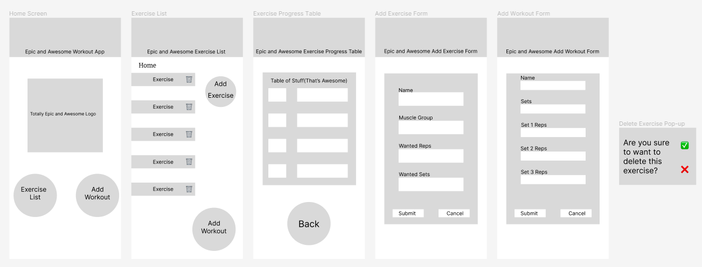

### 30/05/24

Got Feedback from the End User on the Figma UI design

> Yeah that should work, But maybe put the home button up the top, and make it like a home symbol, and also put a home button on the exercise table as well. And Also make it so that if I add a workout from the home page, it takes me back to the home page, rather than taking me straight to the exercise table.

### 10/06/24

Acted on the feedback and made some changes to the UI design

I added the small home symbol into the header but I did need to move the title of the pages over to do so, I also had to make a second "add workout form" page to simulate it being a single page that can take you back to where you entered the form from:
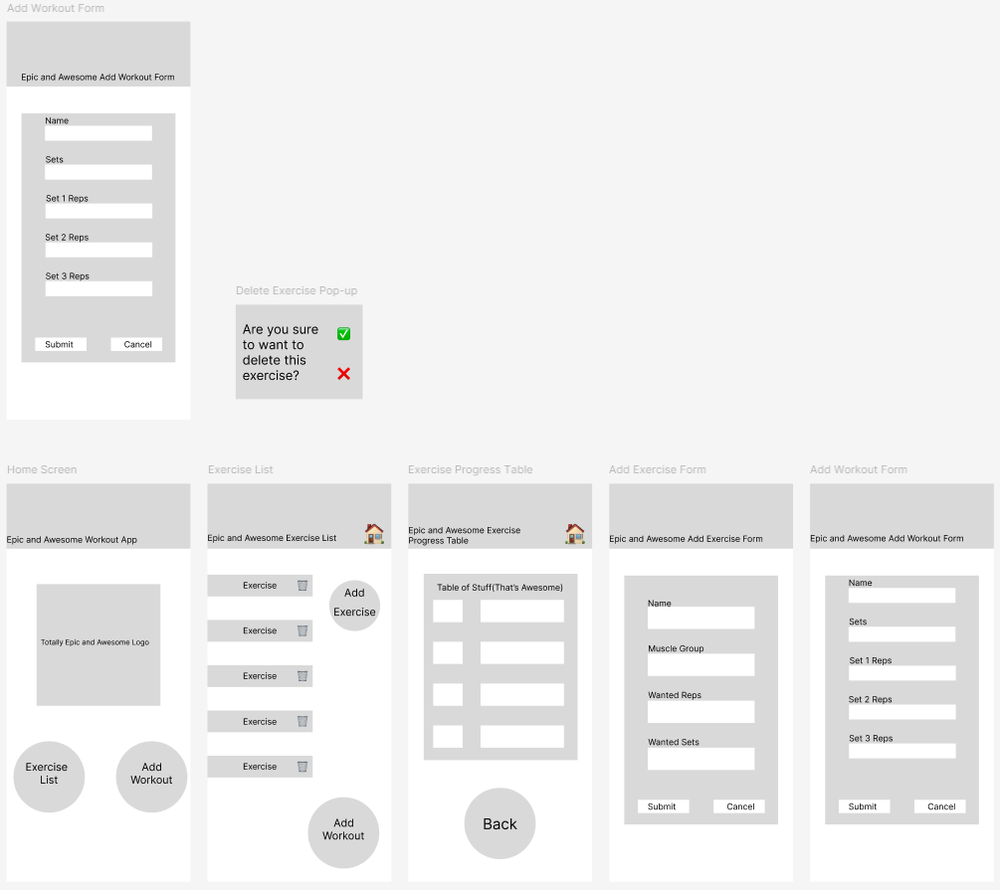

### 11/06/24

Added Colour to the Figma UI Design

I tried to add some darker colors to symbolize the grittiness of the gym and working out, will get feedback from my end user about their opinions on the colors:
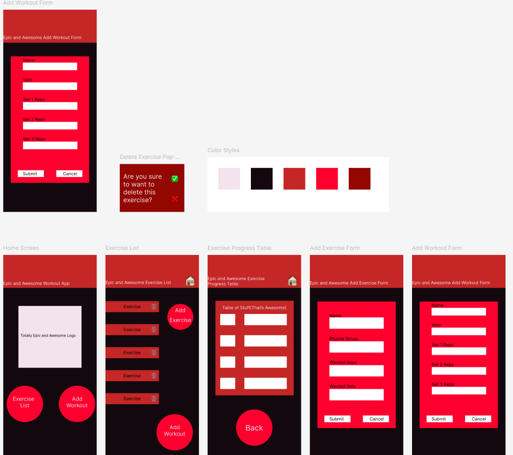

### 13/06/24

Got some feedback from my user so I have made changes to the coloured UI, I also made changes to the database to try and make it more logical and structured

>Centre the title, and also make it bold, make the text on the buttons bold too, I do like the colours though.
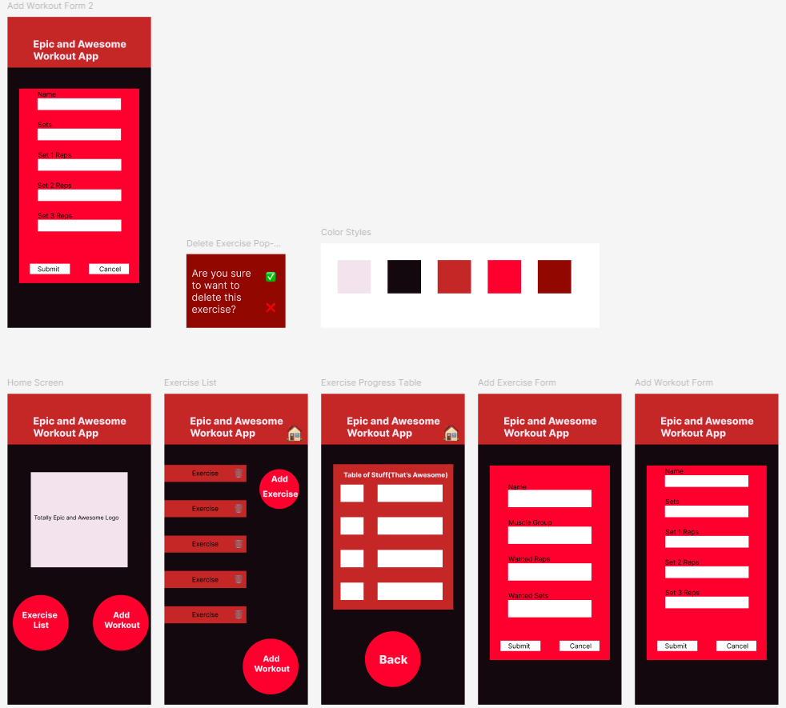

Since their will be multiple exercises in each workout, I moved around most of the segments inside the database, I added a new key to link the exercises to the workouts as well:
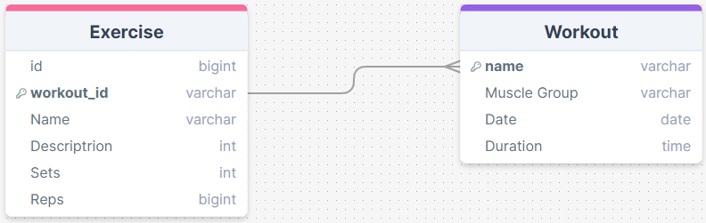

## 18/06/24

I made the home page to my website just a really low quality version:
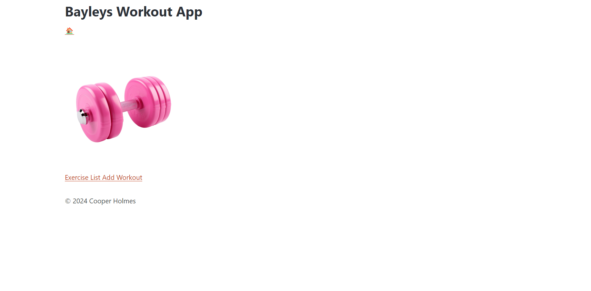

## 20/06/24
I made the exercise list page, didn't add to many details just a description, it's a bit different from the way I made it in figma. Will get feedback on the new design after I make the rest of the page.
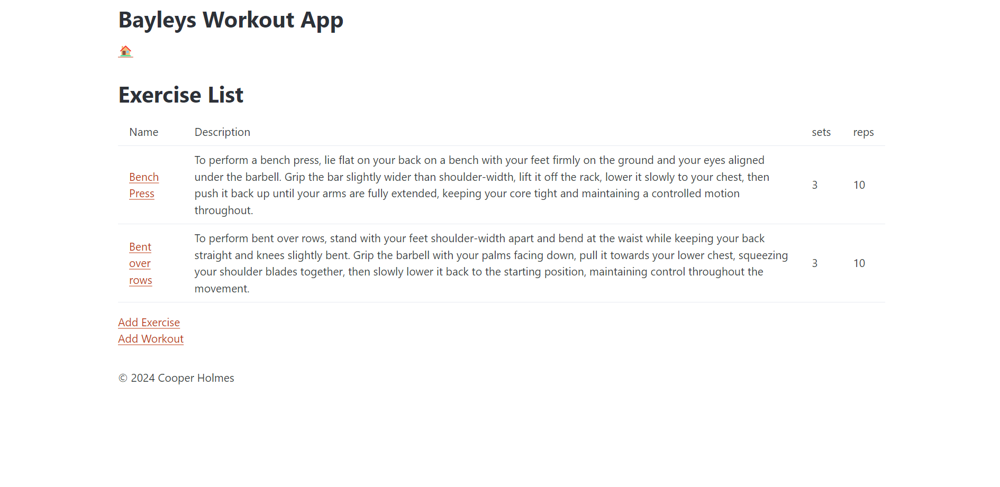

I also redesigned the database with help from sir
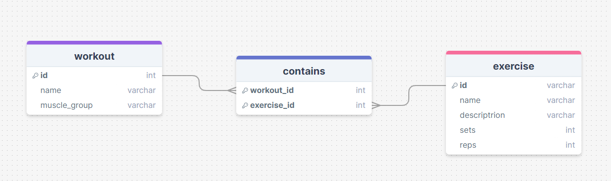

## 24/06/24

I made the add exercise form, looks the same as I wanted it to be
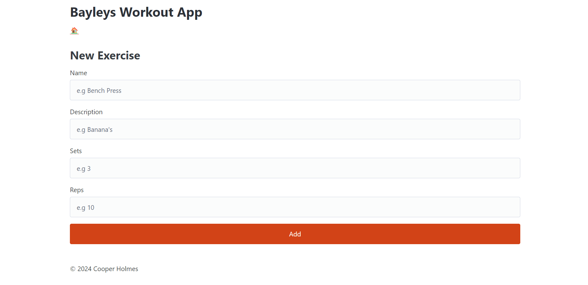