# Development of a Database-Linked Website for NCEA Level 2

Project Name: **Bayleys Epic Workout App**

Project Author: **Cooper Holmes**

Assessment Standards: **91892** and **91893**

-------------------------------------------------

## Design, Development and Testing Log

### 16/05/24

Designing the database

### 20/05/24

Designing the UI for the website

created a flow chart to show how the site would work, Not sure about the add workout section, will get feedback.

### 21/05/24

Got feedback from my user about how he wants the add workout form to work
> It Should be accessible from the exercise list as well, so I don't have to go back to the home page to add a workout.

So I changed the flow chart to show it being accessible fro  the exercise list 

### 23/05/24

Creating version 1 of the UI in figma

Didn't finish, will show to user, get feedback, and finish next time.

### 27/05/24

Finished V1 of UI in figma

Was unable to meet and get feedback, so I finished the design of the Ui with my current ideas and will show to the user for feedback.

### 30/05/24

Got Feedback from the End User on the Figma UI design

> Yeah that should work, But maybe put the home button up the top, and make it like a home symbol, and also put a home button on the exercise table as well. And Also make it so that if I add a workout from the home page, it takes me back to the home page, rather than taking me straight to the exercise table.

### 10/06/24

Acted on the feedback and made some changes to the UI design

I added the small home symbol into the header but I did need to move the title of the pages over to do so, I also had to make a second "add workout form" page to simulate it being a single page that can take you back to where you entered the form from:

### 11/06/24

Added Colour to the Figma UI Design

I tried to add some darker colors to symbolize the grittiness of the gym and working out, will get feedback from my end user about their opinions on the colors:

### 13/06/24

Got some feedback from my user so I have made changes to the coloured UI, I also made changes to the database to try and make it more logical and structured

>Centre the title, and also make it bold, make the text on the buttons bold too, I do like the colours though.

Since their will be multiple exercises in each workout, I moved around most of the segments inside the database, I added a new key to link the exercises to the workouts as well:

## 18/06/24

I made the home page to my website just a really low quality version:

## 20/06/24
I made the exercise list page, didn't add to many details just a description, it's a bit different from the way I made it in figma. Will get feedback on the new design after I make the rest of the page.

I also redesigned the database with help from sir

## 24/06/24

I made the add exercise form, looks the same as I wanted it to be

## 25/06/24

I added a delete button, and it all adds to the table correctly
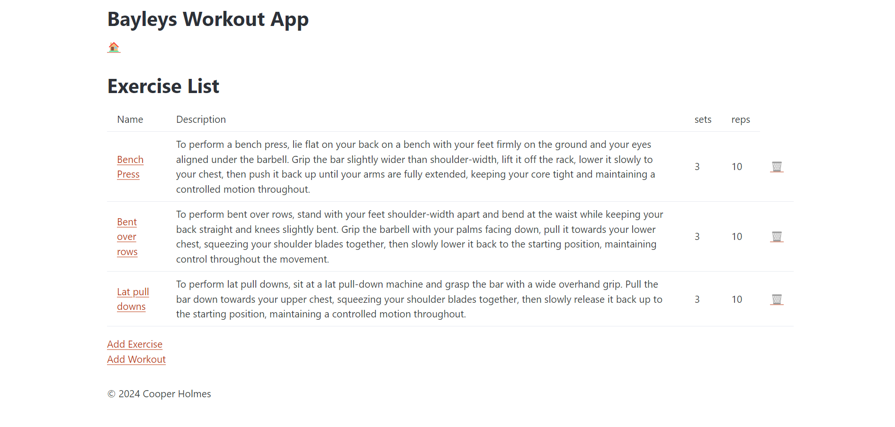

## 27/06/24
 I've decided to put the description in a different page where it says all the stats, as the description doesn't have enough room and is too stretched when in a mobile  format.                                     
 
 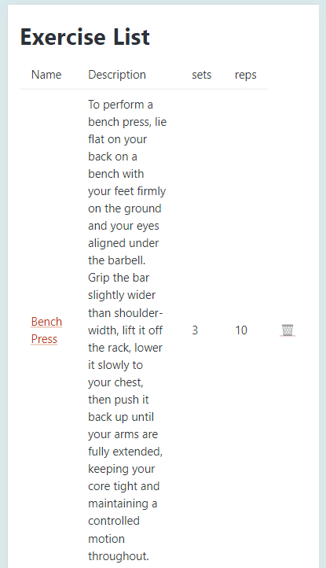   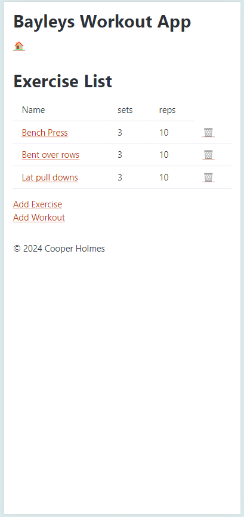

 I also got feedback on the design 
 
 >> Yeah that's cool, it'll be better when you add colours though, and change the home button back to just the word, cause it looks kind of dumb.

 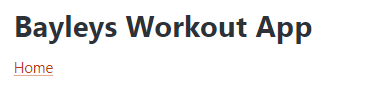

## 4/07/2024

Tried making the exercise description page, ran into a problem I couldn't fix on my own, will get help next time

## 25/07/2024
I finished making the exercise description page with help from others and Mr.Copley, I also have started to remake part of the design, will show changes next class

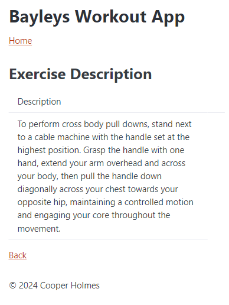

I also showed what I had to my user 
>> Yeah that's all cool, but you should make a page that shows the workouts as well, and also make it so when in that page, when you click on the workout all the exercise in that workout pop up as well as the data for each workout.
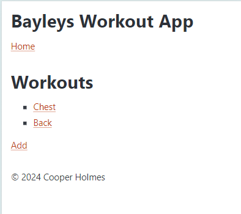     

## 25/07/2024
I got some more feedback on the design of the workout progress page
>> That's cool, but you should stack the exercises of the workout on top of the data, so like i can see the workouts, and then scroll down to see my progress
To do this i had to change my data base to add a date and time table to store the data, this is what i did:
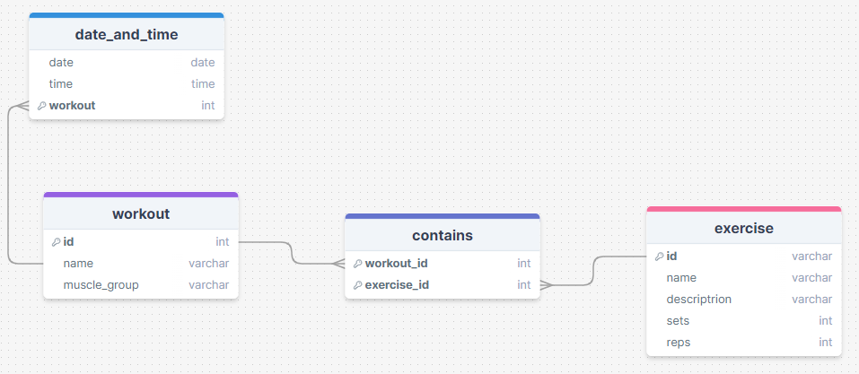
This is how the page looks currently, I haven't put in any data for the workout yet though, and it also isn't fully finished yet as I need to put in all of the exercises for the workout. I also need to rename the buttons next time.
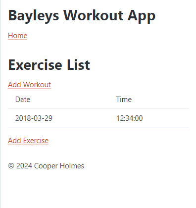

I also made a small change to all of the add workout buttons, that they now take you to the workout page instead of the workout form, which i haven't made yet and do need to make.

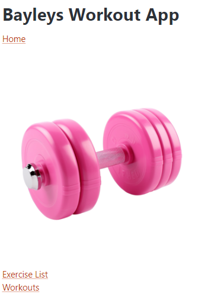

## 06/08/2024

Last lesson i made a change on how to add and delete exercises from the workouts
[image]
I showed my user and they said
>> yeah haha that's actually way better, looks like it'll be much easier too

It doesn't work just yet but they understood what i mean't when i explained it to them

## 08/08/2024

I finished my workout page entirely, can now add and delete workouts, and the links all lead to the correct pages, the exercise progress and modifying i am still working on. I also haven't styled it yet, I want to finish all my coding this week and then I'll style next week

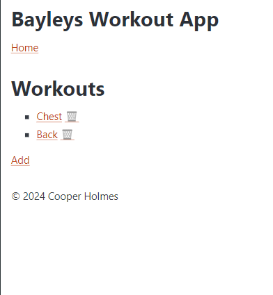

In terms of the new modify page, when adding i have fixed a couple of problems, now it is just pulling the id's out of the url and past pages to insert into the contains table I am very close to the page working properly, I am running out of time, will have to do more work at home and during lunch breaks.

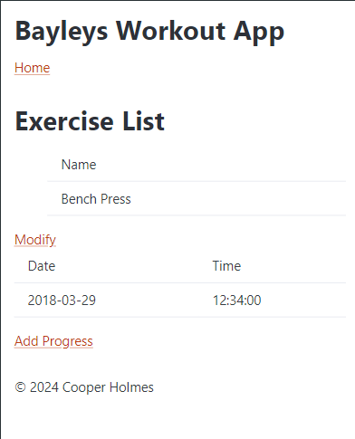  
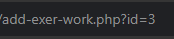
 
## 12/08/24
I've finished the adding in the modify page, now it is just the deleting, this is so close to being done, ive added the delete button and its just a small problem, but it'll be best if i ask for help next time, tonight i will work on the css, and hopefully get the basics working like the colour of the background and buttons

I also spoke to my user about the modify page to see if they were happy with the progress

>> yeah it's perfect, works exactly the way you said it would, once you have those couple of things fixed and add colour though it'll be even better.

## 13/08/24
I've started the code validation on all of my code
here is the result for the exercise list page:
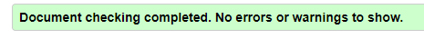

I've also started designing the css this is very rough and this is what it looks like:
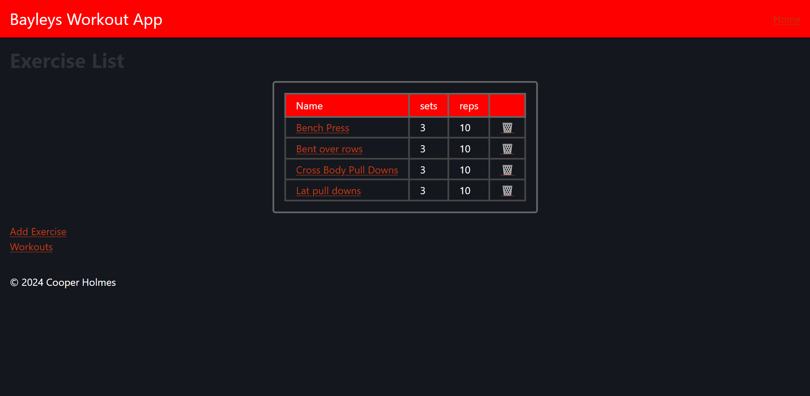
It's got the basic colours that I want, and most of my website it tables and forms, so I should only need to do the designs once, But if i come in at lunch and do work at home I should get it done in time.
